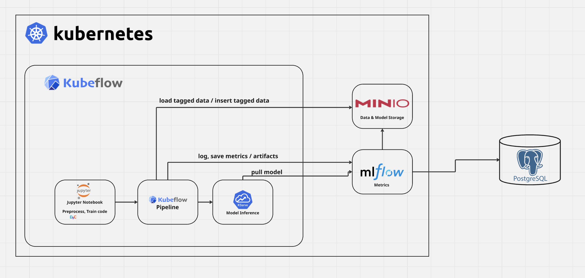

# kubeflow-kind-local-setup
Simple tutorial to get a local version of kubeflow up and running using kind

‼️ Disclaimer ‼️: This is a local setup for testing and DEMO purposes only and should NOT be used in production. The setup uses plain text passwords and no secrets management. Please use this setup at your own risk and do not use it for any sensitive data or production workloads.

## Target Infrastructure


## Prerequisites for Docker Desktop (Settings->Resources)
- 16 GB of RAM recommended.
- 8 CPU cores recommended.
- `kind` version 0.27+.
- `docker` or a more modern tool such as `podman` to run the OCI images for the Kind cluster.
- Linux kernel subsystem changes to support many pods:
    - `sudo sysctl fs.inotify.max_user_instances=2280`
    - `sudo sysctl fs.inotify.max_user_watches=1255360`
 
## Step by Step Tutorial
(adapted from https://github.com/kubeflow/manifests/tree/master?tab=readme-ov-file#install-with-a-single-command)

1. Clone kubeflow manifests repo and cd into it
```
$ git clone https://github.com/kubeflow/manifests

$ cd manifests
```

2. Create Kind Cluster
```sh
cat <<EOF | kind create cluster --name=kubeflow --config=-
kind: Cluster
apiVersion: kind.x-k8s.io/v1alpha4
nodes:
- role: control-plane
  image: kindest/node:v1.32.0@sha256:c48c62eac5da28cdadcf560d1d8616cfa6783b58f0d94cf63ad1bf49600cb027
  kubeadmConfigPatches:
  - |
    kind: ClusterConfiguration
    apiServer:
      extraArgs:
        "service-account-issuer": "https://kubernetes.default.svc"
        "service-account-signing-key-file": "/etc/kubernetes/pki/sa.key"
EOF
```

3. Save Kubeconfig
```sh
kind get kubeconfig --name kubeflow > /tmp/kubeflow-config
export KUBECONFIG=/tmp/kubeflow-config
```

4. Create a Secret Based on Existing Credentials to Pull the Images
```sh
docker login

kubectl create secret generic regcred \
    --from-file=.dockerconfigjson=$HOME/.docker/config.json \
    --type=kubernetes.io/dockerconfigjson
```

5. From the `manifests` folder, cd into `example`
```sh
cd example
```

6. Then install all Kubeflow components using this `kustomization.yaml`
```sh
cd ..

while ! kustomize build example | kubectl apply --server-side --force-conflicts -f -; do echo "Retrying to apply resources"; sleep 20; done
```

7. Make sure to check if all required services are online
```
kubectl get pods -n cert-manager
kubectl get pods -n istio-system
kubectl get pods -n auth
kubectl get pods -n oauth2-proxy
kubectl get pods -n knative-serving
kubectl get pods -n kubeflow
kubectl get pods -n kubeflow-user-example-com
```

8. Access the dashboard by port forward
```
$ kubectl port-forward svc/istio-ingressgateway -n istio-system 8080:80
```

9. Log in with default user name `user@example.com` and the password `12341234`.

10. Allow Jupyter notebook access to ml pipelines
```
$ kubectl apply -f access-kfp-notebook-access.yaml
```

11. Add minio to the cluster

```
$ kubectl apply -f minio-deployment.yaml
```

Open the ports for minio web and api to check if working
```
$ kubectl port-forward -n kubeflow-user-example-com svc/minio 9000:9000 9090:9090
```
and log in with username `minioDev` and pw `minioDevPass123` 

‼️ IMPORTANT ‼️: Make sure to stop the port forwarding again, because minio should only be accessible inside the cluster!!!

12. Add mlflow using community helm chart
Taken from https://artifacthub.io/packages/helm/community-charts/mlflow

Prerequisites:
1. Minio running
2. Postgres managed instance running

Add the repo
```
$ helm repo add community-charts https://community-charts.github.io/helm-charts
$ helm repo update
````

Install the chart
```
helm upgrade --install mlflow community-charts/mlflow --version 0.16.4 --namespace kubeflow-user-example-com \
  --set backendStore.databaseMigration=true \
  --set backendStore.postgres.enabled=true \
  --set backendStore.postgres.host=<HOST>\
  --set backendStore.postgres.port=<PORT> \
  --set backendStore.postgres.database=<DB_NAME> \
  --set backendStore.postgres.user=<PG_USER>  \
  --set backendStore.postgres.password=<PG_PASSWORD>  \
  --set artifactRoot.s3.enabled=true \
  --set artifactRoot.s3.bucket=mlflow \
  --set artifactRoot.s3.awsAccessKeyId=minioDev \
  --set artifactRoot.s3.awsSecretAccessKey=minioDevPass123 \
  --set extraEnvVars.MLFLOW_S3_ENDPOINT_URL=http://minio.kubeflow-user-example-com.svc:9000 
  --set serviceMonitor.enabled=true 
```

13. 🎉 Congratulations! You can now start experimenting and running your end-to-end ML workflows with Kubeflow and Minio


## Setup basic ml lifecylce (mnist training)


1. Add new Jupyter notebook server in Kubeflow (minimum resources: 2 CPUs, 4 GB RAM)
2. Use `notebooks/mnist_keras.ipynb` and execute it
3. 🎉 After this run the metrics and the model should be visible in mlflow
